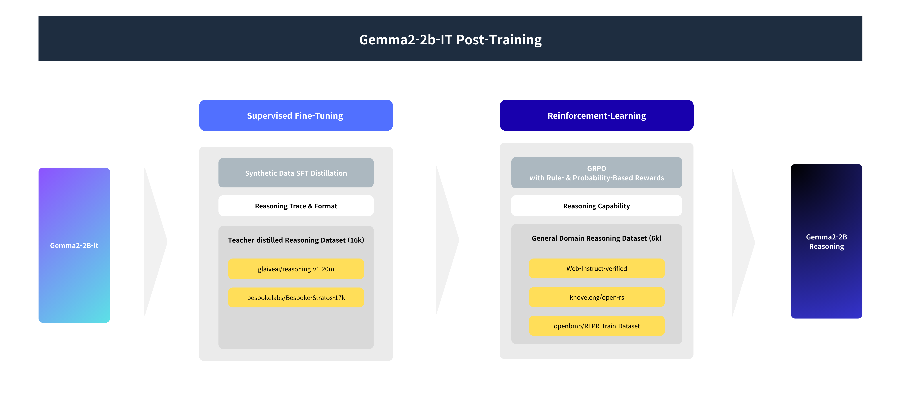
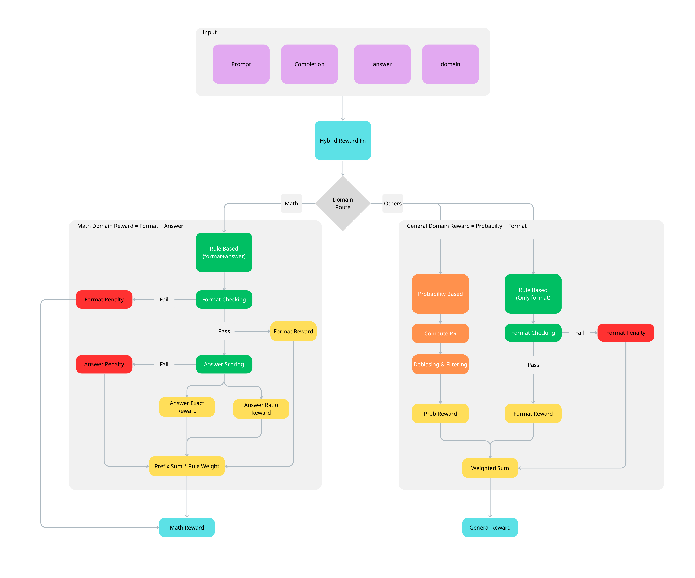

# Google Tunix Hack
### Teach a SLM to reason
<div align="center">
  
</div>

*This project targets the Google Tunix Hack – Train a model to show its work by proposing a **post-training** pipeline that enables small language models (SLMs) to produce explicit and consistent reasoning in general domain using tunix on TPU*

[Tunix Competition](https://www.kaggle.com/competitions/google-tunix-hackathon) | [Kaggle Notebook](https://www.kaggle.com/code/sangminlee09/dod-tunix-hackathon-notebook) | [CKPT](https://www.kaggle.com/models/sangminlee09/dod-gemma2-2b-it-reasoning-800) | [Submission(Mini Report)](https://www.kaggle.com/competitions/google-tunix-hackathon/writeups/dod-google-tunix-hack)


## Overview

<div align="center">
  
</div>

Our approach first applies LoRA-based supervised fine-tuning (SFT) on a teacher-distilled, high-quality general-reasoning dataset to stabilize output format and reasoning behavior. We then perform LoRA-based GRPO reinforcement learning with rule- and probability-based rewards on a general reasoning dataset to improve reasoning ability.


## Method

We select Gemma-2B-IT from the small Gemma family due to its instruction-tuned initialization.

### 👨‍🏫 Synthetic Data SFT Distillation

We adopt LoRA-based SFT as an initial stage to stabilize the model’s reasoning structure. The SFT process is conducted in two stages. In the first stage, the model is trained on general-domain data containing relatively long chains of thought (CoT) to learn reasoning processes. In the second stage, we further fine-tune the model on samples with reasoning lengths of up to 1024 tokens, which is our target length, while slightly increasing the proportion of mathematical reasoning data.

### ⚖️ GRPO with Hybrid Rewards
We apply **Group Relative Policy Optimization (GRPO)** to improve reasoning quality via *relative comparisons among multiple sampled responses per prompt*.  
To support both verifiable and non-verifiable tasks, we design a **domain-routed hybrid reward** with a **shared strict format constraint**.


<div align="center">
  
</div>

All model outputs must follow a strict output contract:

`<reasoning> ... </reasoning>
<answer> ... </answer>`

On top of this shared constraint, **domain-specific rewards** are applied:

- **Math**: format + answer correctness reward  
- **Non-math**: format + probability-based (RLPR-style) reward

For implementation details and more about reward function, please refer to our notebook : [Kaggle Notebook](https://www.kaggle.com/code/sangminlee09/dod-tunix-hackathon-notebook) 


## Datasets
### 📝 SFT Dataset
We construct the SFT dataset by curating and filtering publicly available reasoning corpora, primarily glaiveai/reasoning-v1-20m and bespokelabs/Bespoke-Stratos-17k. Glaiveai provides large-scale general-domain reasoning traces, while Bespoke contributes high-quality, correctness-filtered samples across math, code, science, and logic. All samples are strictly preprocessed to enforce standardized reasoning/answer tag formats, structural validity, token budget constraints, and English-only content.
To accommodate limited computational resources, we apply domain- and CoT length-aware sampling with a 1:4 ratio of long to short CoT, balancing exposure to rich reasoning patterns (e.g., self-correction and verification) with shorter traces that are more learnable for small models. In SFT Stage 2, we further restrict completion length to ≤1024 tokens and slightly increase the proportion of mathematical tasks.

[SFT Dataset](https://www.kaggle.com/datasets/sangminlee09/small-reasoning-model-sft-dataset)

### 📚 RL Dataset
The RL dataset integrates multiple reasoning-oriented sources to ensure broad general-domain coverage. Rule-verifiable tasks are drawn from knoveleng/open-rs, retaining only samples with unambiguous numeric ground-truth answers (integers, floats, and rational fractions in plain-text or LaTeX form). Non-verifiable tasks include creative, preference-driven samples from SAA-Lab/LitBench-Train and general reasoning tasks from openbmb/RLPR-Train-Dataset. For datasets with difficulty annotations, samples are stratified using a 1:3 Easy-to-Hard ratio, while creative tasks are included as a fixed-size subset selected based on user preference signals.

[RL Dataset](https://www.kaggle.com/datasets/sangminlee09/small-reasoning-model-rl-dataset)

## Repository Structure
```
├─ configs/       
├─ src/            
│  ├─ data/ 
│  ├─ models/      
│  ├─ reward/      
│  ├─ rl/          
│  ├─ sft/         
│  └─ rl/          
├─ notebooks/     
├─ assets/        
└─ README.md
```